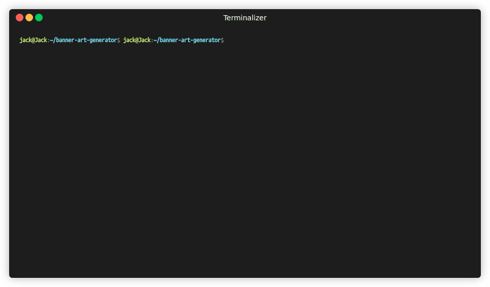

# 🎨 Banner Art Generator

[](https://python.org)
[](https://opensource.org/licenses/MIT)
[](https://github.com/sponsors/setuju)

A fun, interactive Python tool to create colorful ASCII art banners using **pyfiglet** and **termcolor**. Perfect for terminal greetings, project headers, or just for fun!



## ✨ Features

- 🎲 **Random welcome banner** – “Jack” appears with random font & colors every run  
- 🎨 **Fully customizable** – choose your own text, font, text color, and background  
- 🎉 **Surprise me!** – let the script pick a random font and colors for your text  
- 🚫 **Smart color selection** – prevents foreground and background from being the same  
- 📋 **Exportable Python code** – after generating a banner, get a ready‑to‑run script  
- 🔢 **Grid layout** – fonts and colors displayed in clean columns  
- 💾 **Save to file** – save your plain banner to a text file  

## 🛠️ Installation

Clone the repository and install the dependencies:

```bash
git clone https://github.com/setuju/banner-art-generator.git
cd banner-art-generator
pip install -r requirements.txt
```

🚀 Usage
Run the script:
```bash
python banner_art.py
```

Then follow the interactive prompts:

    Enter your text
    
    Choose a font (from top 19, all fonts, custom, or Surprise me!)
    
    Pick text and background colors (or skip for plain)
    
    See your banner instantly!
    
    Optionally save it to a file or get the Python code.


📸 Demo
The GIF above shows the entire workflow. You can also try it yourself!


📁 Examples
The examples/ folder contains sample outputs generated by the tool, including:
```
banner.txt – plain text banner

banner2.txt – another banner example

jack.py – Python code that reproduces a specific banner

jack2.py – another code snippet

Feel free to use them as inspiration.
```

🤝 Contributing
    Contributions are welcome! Please feel free to submit a Pull Request.
    
    Idea starters:
    
    Save banner with ANSI colors
    
    Export as HTML/CSS
    
    Add a simple GUI (Tkinter or web)
    
    More color attributes (bold, underline)


📄 License
    This project is licensed under the MIT License – see the LICENSE file.

👤 Author
    Jack – GitHub

Made with ❤️ and Python
